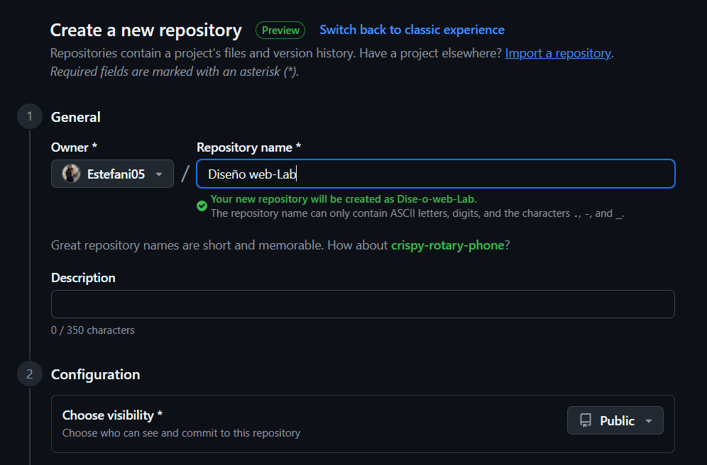

Documentación técnica
Laboratorio 1 – Tecnologías Web Modernas

Nombre: Estefani Valverde
Carné: 2021554564
Curso: IC-8057 – Introducción al Desarrollo de Páginas Web
Fecha:08/08/2025

### 1. Frameworks de desarrollo web
a. ¿Qué es un framework y qué problema resuelve?

Un framework es un conjunto de herramientas y componentes reutilizables que facilitan el desarrollo de aplicaciones web. Proporciona una estructura base, buenas prácticas y soluciones a problemas comunes (como enrutamiento, gestión de datos, seguridad), permitiendo a los desarrolladores enfocarse en la lógica de negocio y acelerar el desarrollo.

b. Arquitectura general y enfoque (MVC, SPA, SSR)

- **MVC (Modelo-Vista-Controlador):** Divide la aplicación en tres partes: modelo (datos), vista (interfaz) y controlador (lógica). Ejemplo: Ruby on Rails, ASP.NET.
- **SPA (Single Page Application):** La aplicación carga una sola página y actualiza el contenido dinámicamente sin recargar. Ejemplo: React, Angular.
- **SSR (Server Side Rendering):** El servidor genera el HTML antes de enviarlo al navegador, mejorando SEO y rendimiento inicial. Ejemplo: Next.js, Nuxt.js.

c. Ejemplo práctico documentado (estructura de proyecto, fragmento de código comentado)

Ejemplo con React (SPA):

Estructura básica:
```
mi-app/
│
├── public/
│   └── index.html
├── src/
│   ├── App.js
│   └── index.js
├── package.json
```

Fragmento de código comentado:
````javascript
// src/App.js
import React from 'react';

function App() {
  // Componente principal de la aplicación
  return (
    <div>
      <h1>Hola, mundo!</h1>
      {/* Aquí se agregan más componentes */}
    </div>
  );
}

export default App;
``````


d. Comparación breve entre al menos dos frameworks

##### React: 
Biblioteca enfocada en construir interfaces de usuario como SPA. Es flexible, tiene gran comunidad y ecosistema.

##### Angular: 

Framework completo que incluye herramientas para desarrollo, pruebas y despliegue. Usa TypeScript y sigue el patrón MVC.

#### Diferencias: 
React es más ligero y flexible, ideal para proyectos personalizados. Angular es más estructurado y robusto, recomendado para aplicaciones grandes y equipos grandes.

Citas bibliograficas :
https://unirfp.unir.net/revista/ingenieria-y-tecnologia/framework/
https://imaginaformacion.com/tutoriales/que-es-un-framework


### 2. Control de versiones y trabajo colaborativo

a. ¿Qué es el control de versiones y por qué es esencial?

El control de versiones es un sistema que registra los cambios realizados en archivos a lo largo del tiempo. Es esencial porque permite recuperar versiones anteriores, colaborar en equipo sin perder trabajo, y mantener un historial claro de modificaciones.

b. Conceptos clave: repositorio, commit, branch, merge, pull request

- **Repositorio:** Lugar donde se almacenan los archivos y el historial de cambios.
- **Commit:** Registro de un cambio realizado en el repositorio, acompañado de un mensaje descriptivo.
- **Branch (rama):** Línea de desarrollo independiente para trabajar en nuevas características o correcciones.
- **Merge:** Proceso de combinar los cambios de una rama con otra.
- **Pull request:** Solicitud para revisar y fusionar cambios de una rama a la principal, común en plataformas colaborativas.

c. Flujos de trabajo comunes (Git Flow, trunk-based, feature branches)

- **Git Flow:** Uso de ramas específicas para desarrollo, producción y características, ideal para proyectos grandes.
- **Trunk-based:** Todos los cambios se integran rápidamente en la rama principal, favoreciendo despliegues continuos.
- **Feature branches:** Cada nueva funcionalidad se desarrolla en una rama aparte y luego se fusiona.

d. Ejemplo de cómo usar Git en un proyecto (inicialización, commits, ramas)

```bash
# Inicializar repositorio
git init

# Agregar archivos y hacer commit
git add .
git commit -m "Primer commit"

# Crear una rama y cambiarse a ella
git branch nueva-funcionalidad
git checkout nueva-funcionalidad

# Fusionar cambios a la rama principal
git checkout main
git merge nueva-funcionalidad
```

e. Herramientas recomendadas (GitHub, GitLab, Bitbucket)

- **GitHub:** Plataforma popular para alojar repositorios y colaborar en proyectos.
- **GitLab:** Ofrece integración con CI/CD y gestión de proyectos.
- **Bitbucket:** Permite repositorios privados y se integra con otras herramientas de Atlassian.

Citas Bibliograficas:
https://www.atlassian.com/es/git/tutorials/comparing-workflows/gitflow-workflow
https://epirhandbook.com/es/new_pages/collaboration.es.html

### 3. Autenticación y seguridad moderna

a. Conceptos: autenticación, autorización, tokens, JWT, OAuth

Autenticación: Proceso de verificar la identidad de un usuario (por ejemplo, iniciar sesión con usuario y contraseña).

Autorización: Proceso de determinar los permisos o accesos que tiene un usuario autenticado dentro de una aplicación.

Tokens: Fragmentos de información digital que se usan para identificar y validar sesiones de usuario. Permiten el acceso seguro sin enviar credenciales en cada petición.

JWT (JSON Web Token): Tipo de token que contiene información codificada (como el usuario y sus permisos) y se usa para autenticación y autorización en aplicaciones web modernas.

OAuth: Protocolo estándar que permite a los usuarios autorizar a aplicaciones de terceros a acceder a sus datos sin compartir sus credenciales, común en acceso a APIs y servicios externos.


b. Diagrama de flujo explicativo del proceso de autenticación con JWT



c. Buenas prácticas en seguridad web

- Usar HTTPS para cifrar la comunicación entre cliente y servidor.
- Validar y sanitizar todos los datos recibidos desde el usuario.
- Implementar autenticación robusta (contraseñas seguras, autenticación multifactor).
- Mantener el software y dependencias actualizadas.
- Limitar los permisos y accesos según el rol del usuario.
- Proteger contra ataques comunes como XSS, CSRF y SQL Injection.
- Almacenar contraseñas usando algoritmos de hash seguros (ej. bcrypt).
- Utilizar tokens seguros y con expiración para sesiones.

d. Aplicaciones reales en plataformas modernas
1. Adalo
Ideal para crear apps visuales sin escribir una sola línea de código. Conecta con bases de datos, pagos y notificaciones push. Muy utilizada por startups.

2. Glide
Permite transformar hojas de cálculo de Google Sheets en apps móviles funcionales. Perfecta para apps internas y proyectos rápidos.

3. Thunkable
Muy versátil para proyectos educativos o prototipos funcionales. Permite usar lógica mediante bloques de arrastrar y soltar.

4. Bravo Studio
Permite convertir diseños Figma en apps sin programar. Ideal para diseñadores que quieren prototipos funcionales reales.


Citas Bibliograficas:
https://www.spainclouds.com/blog/oauth-2-0-openid-connect-y-json-web-tokens-jwt-que-es-que

https://neoattack.com/blog/plataformas-app/

### 4. Gestores de contenido desacoplados (Headless CMS)
a. Definición de Headless CMS vs CMS tradicional

CMS tradicional: Sistema que gestiona el contenido y la presentación en una sola plataforma (ejemplo: WordPress). El frontend y backend están integrados.
Headless CMS: Solo gestiona el contenido y lo expone mediante APIs. El frontend se desarrolla aparte y consume los datos desde el CMS.

b. Arquitectura basada en APIs

El Headless CMS almacena el contenido y lo entrega a cualquier frontend (web, móvil, etc.) a través de APIs REST o GraphQL. Esto permite separar la gestión de contenido de la presentación.

c. Ventajas, limitaciones y casos de uso comunes

**Ventajas:**  
- Flexibilidad para usar cualquier tecnología en el frontend.
- Fácil integración con múltiples plataformas (web, apps móviles, IoT).
- Mejor rendimiento y escalabilidad.

**Limitaciones:**  
- Requiere desarrollo adicional para el frontend.
- Puede ser más complejo para usuarios no técnicos.

**Casos de uso comunes:**  
- Sitios web corporativos con frontend personalizado.
- Aplicaciones móviles que consumen contenido dinámico.
- Proyectos multicanal (web, app, dispositivos).

d. Ejemplo de cómo se conecta el frontend a un CMS headless


Ejemplo usando JavaScript para consumir contenido de un Headless CMS (ejemplo: Strapi):

```javascript
// Ejemplo básico usando fetch para obtener datos de Strapi
fetch('https://mi-strapi-api.com/api/articulos')
  .then(response => response.json())
  .then(data => {
    // Mostrar artículos en el frontend
    console.log(data);
  });
```

Citas Bibliograficas:
https://aws.amazon.com/es/what-is/headless-cms/
https://digital55.com/blog/headless-cms-gestion-innovadora-versatil-contenidos-web/


### 5. Pasarelas de pago en aplicaciones web
a. ¿Qué es una pasarela de pago? ¿Qué rol cumple en una aplicación moderna?

Una pasarela de pago es un servicio que permite procesar pagos electrónicos de forma segura entre el cliente y el comercio. En una aplicación moderna, facilita la recepción de pagos en línea, valida transacciones y protege los datos financieros.

b. Requisitos comunes: cuenta de comercio, seguridad, integración técnica

- **Cuenta de comercio:** Es necesario tener una cuenta con la pasarela para recibir pagos.
- **Seguridad:** Implementa cifrado y cumple con estándares como PCI DSS para proteger datos sensibles.
- **Integración técnica:** Requiere conectar la aplicación mediante APIs o SDKs, y configurar métodos de pago (tarjetas, transferencias, etc.).


c. Ventajas y limitaciones de integrar pagos en línea

**Ventajas:**
- Permite ventas 24/7 y alcance global.
- Facilita la automatización de cobros y gestión de pedidos.
- Ofrece seguridad y confianza al usuario.

**Limitaciones:**
- Puede tener costos por transacción y mantenimiento.
- Requiere cumplir normativas de seguridad.
- La integración puede ser compleja según la plataforma.

d. Comparación entre al menos dos pasarelas (ej. Stripe, TiloPay, Bancos, etc.)

- **Stripe:** Internacional, fácil de integrar, soporta múltiples métodos de pago y monedas. Ofrece documentación clara y herramientas para desarrolladores.
- **TiloPay:** Orientada al mercado latinoamericano, integración con bancos locales, soporte en español y opciones de pago regionales.
- **Bancos tradicionales:** Ofrecen pasarelas propias, suelen requerir más trámites y la integración puede ser menos flexible, pero son confiables para grandes empresas.

### 6. Automatización del despliegue y hosting moderno
a. ¿Qué es CI/CD y por qué se usa en desarrollo web?

CI/CD significa Integración Continua y Entrega/Despliegue Continuo. Es un conjunto de prácticas y herramientas que automatizan la integración de cambios en el código, las pruebas y el despliegue en servidores. Se usa en desarrollo web para mejorar la calidad, reducir errores y acelerar la entrega de nuevas versiones.

b. Hosting estático vs dinámico

 **Hosting estático:** Aloja archivos HTML, CSS y JavaScript que no cambian en el servidor. Es rápido, seguro y económico. Ejemplo: GitHub Pages, Netlify.
 **Hosting dinámico:** Permite ejecutar código en el servidor (PHP, Node.js, bases de datos) y generar contenido en tiempo real. Ejemplo: Heroku, Vercel, AWS.

c. Flujo de despliegue automatizado

1. El desarrollador sube cambios al repositorio (por ejemplo, en GitHub).
2. Un sistema CI/CD detecta los cambios y ejecuta pruebas automáticas.
3. Si las pruebas pasan, el sistema construye la aplicación y la despliega automáticamente en el hosting seleccionado.
4. El sitio web o aplicación se actualiza sin intervención manual, asegurando rapidez y confiabilidad.

Citas bibliograficas
https://unity.com/es/topics/what-is-ci-cd
https://www.siteground.es/kb/sitio-web-estatico-vs-dinamico/


d. Documentar el proceso seguido para desplegar la parte 2 del laboratorio